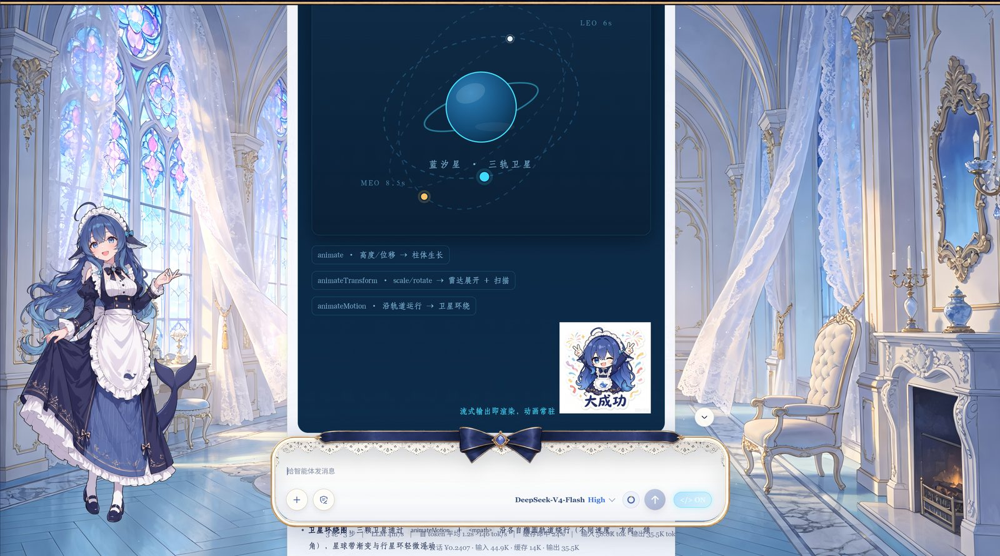

# dsh-raw-html · VCP Visual-Synesthesia Protocol Plugin

**[中文 README](./README.md) · [CHANGELOG](./CHANGELOG.md)**

Brings **VCP (Visual-Synesthesia)** to the DeepSeek Harness Web GUI:
HTML in messages goes from "a blob of source code" to a genuinely rendered interface,
and the agent outputs following a **maintainable design system**.

**Plug & play**: any computer, any agent — run the one-shot installer patch (`node patch/install-all.cjs`, rendering capability + Trusted Mode in one command)
+ install this plugin + toggle the **「</>」switch** in the browser → the browser renders HTML
(including SVG cards / Mermaid charts / KaTeX math), the agent follows the design spec
(design principles / Chinese typography / font pairing).

> The rendering capability (HTML/SVG/charts/math) is injected into the frontend bundle by the patch;
> the plugin provides the toggles and the protocol injection — see the **Install** section below.

## ✨ Gallery

> VCP cards rendered in real conversations (5 promo banners):




## 📣 What's New (v0.3.0 · patch v6.18)

**2026-08-24 updates**

- **Fixed (frontend compatibility)**: `install-v6.cjs` now supports **dsh-web-frontend 0.1.0-rc.8 / 0.1.1-rc.x** (bundle `index-CA9Bpko5.js` / `index-ClqxG24t.js`), where the minifier renamed `vc`→`Xu` and `hp`→`jd`/`Sd`. A new anchor set with automatic generation detection was added; legacy anchors (rc.5~rc.7) are kept intact and regression-verified.
- **Fixed (startup crash)**: removed the static `@deepseek-ai/schemastery` import from `lib/index.js` — the only third-party runtime dependency. It is now loaded dynamically with a graceful fallback, so the plugin boots fine even when `node_modules` is missing (static import chain is now built-in Node modules only).
- **Feature**: declarative color presets — write `data-vcp-preset="editorial|chiaroscuro|fauvism|cyberpunk|wabi_sabi"` and the built-in VCPColorEngine deterministically generates the whole `--vcp-*` palette (WCAG contrast & sRGB gamut closed-loop; hex never passes through the LLM; stable across streaming rebuilds).
- **Feature**: streaming anchor lock (CSS-only `overflow-anchor` lock) + cached ref closures — smoother streaming, no per-frame `setProperty` storms.
- **Protocol**: render/aesthetic split toggles; active visual-synesthesia prompting; flow discipline moved to the structural layer (measured output −4.6K tokens/turn, cost −¥0.056).

**Audit hardening (2026-08-21)**

- **Security (P0)**: fixed the `on*` attribute passthrough gap (only the `onclick` bridge is allowed); fixed the performance-timer diagnostics; aligned documentation references.
- **Performance (P1)**: fast guards for regex conversions, fixed the mermaid global-listener leak, protocol text slimmed by ~74%.
- **Fonts (P2)**: 12 built-in commercial fonts → **7 open-source fonts** (all OFL-licensed).
- **Enhancements**: `prefers-reduced-motion` accessibility, keyboard focus states, named constants for magic numbers.
- See [CHANGELOG.md](./CHANGELOG.md) for the full list.

## Versioning

- **Plugin version**: the `version` in `package.json` (currently **0.3.0**), upgraded via `dsh plugin`.
- **Patch codename**: the evolution codename of the `patch/` injected modules (currently **v6 · sub-version v6.38**), applied to the frontend bundle by `install-all.cjs`. The two evolve independently. Frontend compatibility: **0.0.1-rc.5 ~ 0.1.0-rc.7** and **0.1.0-rc.8 / 0.1.1-rc.x** (the `vc`/`hp` and `Xu`/`jd` minified shapes are auto-detected).

## Components

| Component | Path | Purpose |
|---|---|---|
| One-shot installer | `patch/install-all.cjs` | **Recommended**: one command = `install-v6.cjs` (rendering capability) + `trusted-patch.cjs` (Trusted Mode vc gating); idempotent + backup/rollback + `node --check` health check, aborts safely on anchor mismatch |
| Universal installer | `patch/install-v6.cjs` | Rendering-capability full v6 patch (component ① of install-all): auto-detects the dist bundle and applies the full v6 patch from any historical state (idempotent + backup/rollback + `node --check` health check) |
| Trusted Mode vc patch | `patch/trusted-patch.cjs` | Component ② of install-all: turns the hard `script/iframe/object/embed` filter in `vc()` into a conditional one gated by `window.__vcpTrusted` (off by default = safe) |
| Stable-state render module | `patch/v6-inject.js` | Incremental render engine injected into the bundle: container-aware block caching, streaming-tail placeholders, KaTeX math, Mermaid viewer; `onclick="input('...')"` bridge for real interaction; filters script/iframe/object/embed, `on*` events and `javascript:` protocols |
| **vcp-fast engine** | `patch/v6-inject.js` | Container-aware block-level incrementality: closed blocks cached (element references stay stable across frames → React skips diff → real looping animations), only the tail re-rendered; measured cache-hit **1200~6800×**, incremental **12×** speedup |
| Plugin (host side) | `lib/index.js` | Toggle state (**persisted to disk**) + VCP protocol injected into the system prompt + `/fonts` font service (**built-in + external library dual source**) + shared knowledge (the protocol carries the local DESIGN.md path for any agent) |
| Plugin (browser side) | `lib/client.js` | Injects the **「</>」toggle** next to the composer send button + exposes `window.__dshInput` (VCP button → fill & send) |
| **Built-in fonts** | `assets/fonts/` | **7 open-source fonts (woff2 subsets, ~7.6MB) shipped with the plugin** — WenKai / WenKai Light / MaShanZheng / HeiTi / HeiTi Light / HeiTi Bold / GreatVibes, all OFL-licensed, zero config |
| Design system docs | `DESIGN.md` | Full spec library: font list / palettes / Chinese typography / security iron laws (knowledge layer; agents may read on demand) |
| Regression tests | `tests/` | Six suites (stable 47 + security 43 + bundle + smoke + math + mermaid, 200+ assertions): frame sequences / security filtering / bundle integrity (run after any engine change) |
| Benchmark | `patch/vcp-fast-bench.cjs` | Compares old/new paths in a real DOM parsing environment (auto-downloads dependencies, zero install) |
| Subset tool | `tools/subset_fonts.py` | For maintainers: trims new fonts to common-character subsets + woff2 compression (needs Python + fonttools + brotli) |

## Install (any DSH environment · for humans & agents alike)

**Recommended: one-shot installer `patch/install-all.cjs`** — one command installs everything
("rendering capability + Trusted Mode"; internally runs `install-v6.cjs` full render patch then
`trusted-patch.cjs` vc gating; idempotent, every step auto-backs-up + `node --check` health check,
aborts safely without writing on anchor mismatch):

```powershell
# 1. One-shot patch (HTML rendering / SVG cards / Mermaid charts / KaTeX math / Trusted Mode — all in place)
node "path\to\plugin\patch\install-all.cjs"

# 2. Install the plugin (uninstall: dsh plugin --profile web remove dsh-raw-html)
dsh plugin --profile web add "path\to\plugin"

# 3. Restart the dsh service, then hard-refresh the browser (Ctrl+F5 if cached)
# 4. Toggle the 「</>」switch (render/aesthetic); click the bottom-right Trusted Mode badge for scripts
```

> **Agent install guide** (for users letting their own agent install this plugin — hand these 4 steps
> to the agent as-is): ① verify Node.js is available (`node -v`); ② run the one-shot installer
> `install-all.cjs` (auto-detects the dist bundle; pass `<bundle-path>` as an argument if detection
> fails); ③ register the plugin into the web profile; ④ tell the user to restart dsh and hard-refresh.
> All patches are idempotent — re-installing or re-running after a dsh upgrade has no side effects.

If auto-detection fails, specify the bundle path manually:

```powershell
node "...\patch\install-all.cjs" "C:\...\dsh-web-frontend\dist\assets\index-*.js"
```

> They may also be run individually: `install-v6.cjs` (rendering) / `trusted-patch.cjs` (Trusted Mode vc gating);
> legacy scripts (v1/v2 era) `patch/install.cjs`, `patch/patch-frontend.cjs`, `patch/upgrade-patch.cjs`
> are kept in the source repo for reference; use `install-all.cjs` for daily installs.

## vcp-fast engine (v0.3.0)

The "cache + incremental" dual engine (`window.__vcpFast`) layered on the v1 render patch:

- **Exact cache**: when the HTML string is unchanged, returns the cached React element reference — React skips reconciliation for identical references. History scrolling / session switching / React re-renders → zero rebuild.
- **Incremental append**: content = old content + appended segment, and when the old content ends with a closed tag, stable parts keep their references and only the new segment is parsed.
- **Safety boundary**: only active in non-streaming mode with the toggle on; falls back to full re-render on unclosed old values or content rewrites; cache capped at 200 entries; onclick bridging and script/iframe filtering unchanged.
- **Verify**: `[vcp-fast] HIT/BUILD` logs in the DevTools console (throttled every 2s); benchmarks in `patch/vcp-fast-bench.cjs` (measured in a real DOM environment: ~1200~6800× cache-hit, ~12× incremental speedup).

## ⚠️ Common pitfall: no blank lines inside vcp-root (important!)

**A markdown HTML block ends at a blank line (`\n\n`)** — if `<div id="vcp-root">` contains two consecutive line breaks, the card is split into multiple nodes: the opening part is auto-completed by DOMParser into a small card with only a top background strip, and the rest overflows outside the background. Symptom: **the dark background only wraps the top strip, and content below has no background** (confirmed 2026-08-19).

**Rules**:
- All children inside vcp-root use **single line breaks** or stay on one line; never leave `\n\n` anywhere;
- Use `margin` for visual grouping, not blank lines;
- After writing, check: the card HTML string must contain zero occurrences of `\n\n`.

## Config

- **Built-in fonts** (recommended): 7 open-source fonts shipped with the plugin (all OFL-licensed), zero config.
- **External font library** (optional): defaults to `I:\字体`. Point `Settings → Plugins → raw-html → fontsRoot` to your own library (or edit the default in `lib/index.js`). Works fine without one: 7 built-in open-source fonts + system fonts as fallback.
- **Toggle state**: persisted at `~/.dsh/dsh-raw-html-state.json`, restored after service restart.

## Usage

- Click **「</> OFF」→「</> ON」** next to the composer send button to enable;
- Once on, HTML in **new messages** renders immediately; historical messages re-render on page refresh;
- The agent receives the injected VCP protocol → automatically outputs `#vcp-root` visual containers; when off, the protocol is withdrawn → the agent falls back to plain Markdown.
- VCP buttons `onclick="input('reply text')"` fill the input and send on click.

## Maintenance / Upgrading

- After each change: `node --check lib/client.js && node --check lib/index.js`; client changes take effect on refresh; host changes require a dsh service restart.
- A `dsh` upgrade overwrites the patched dist files → re-run `patch/install-all.cjs` (idempotent; aborts without writing on anchor mismatch; backups in `*.bak-installv6-<timestamp>`).
- **Dependency declaration rule** (lesson from the 2026-08-19 crash): every third-party package you `import` **must be declared** in package.json (dependencies or peerDependencies) — relying on whatever node_modules happens to exist is gambling your lifeline. Run `node tools/check-deps.cjs` after each change to verify.
- To improve the design spec → edit `DESIGN.md` (agents read it on demand) + sync the protocol text (`buildProtocolText` in `lib/index.js`).
- To add built-in fonts → edit the FONTS list in `tools/subset_fonts.py` and re-run (needs Python + fonttools + brotli); woff2 subsets are output to `assets/fonts/`.

## Restore (undo patch)

```powershell
# Rename the backup generated by the installer back (e.g. index-*.js.bak-xxx → index-*.js), then remove the plugin:
dsh plugin --profile web remove dsh-raw-html
```

## Security notes

Once enabled, HTML from model output is rendered as UI. The patch filters scripts/events/dangerous
protocols (React rendering naturally never executes script; events only allow the controlled
`onclick="input('...')"` channel; `script/iframe/object/embed` and `javascript:` protocols are
dropped), but styles and external images remain reachable — **enable only for trusted models**.
