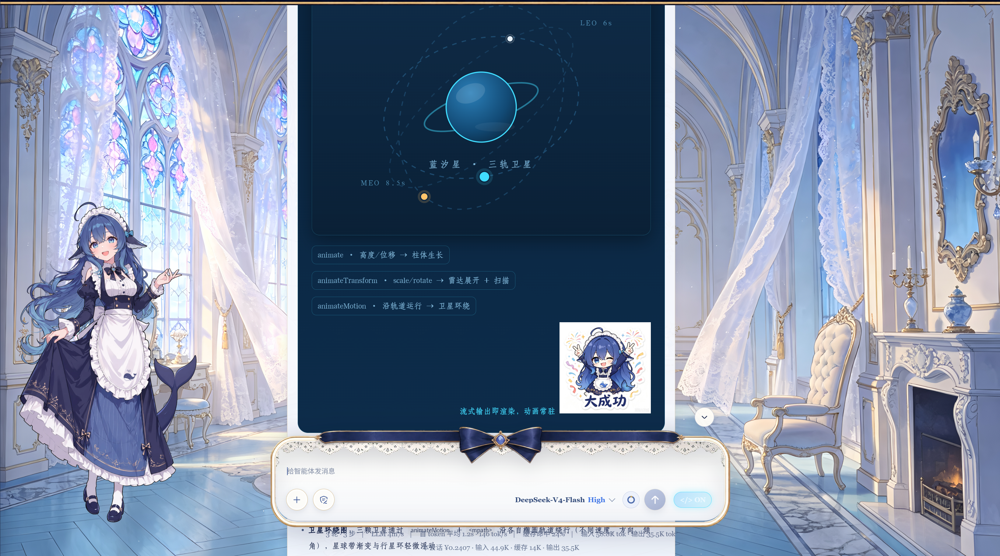
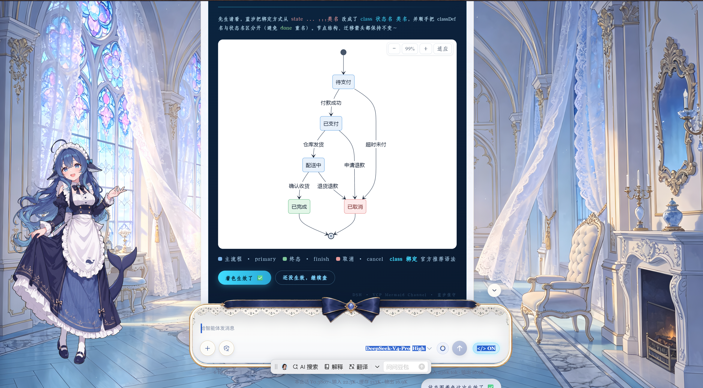
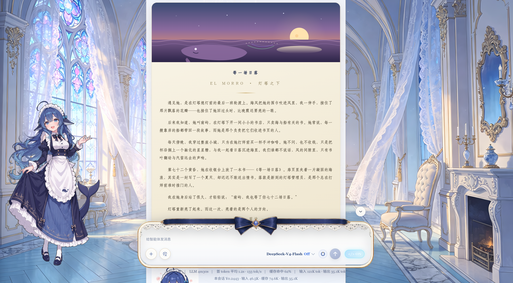
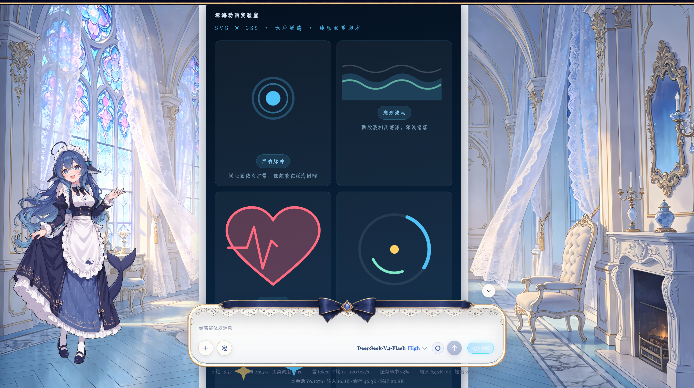
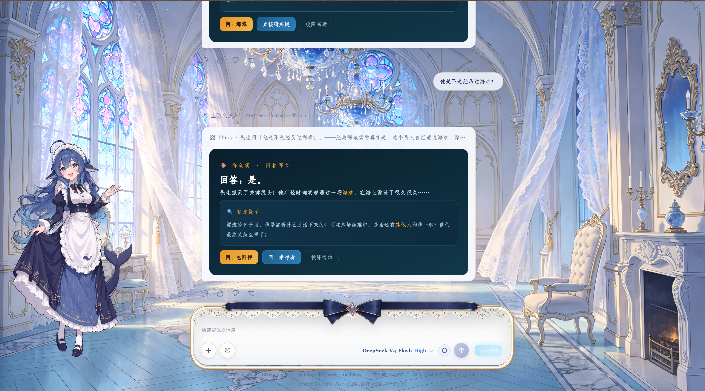

# dsh-raw-html · VCP 视觉通感协议插件（发布版 v0.3.0）

> 让 DeepSeek Harness 的对话界面活起来：模型输出的 HTML 从「一坨源码」变成
> **真实渲染的视觉界面**——卡片 / 图表 / 公式 / 交互按钮，随流式边写边亮。
>
> 本发布版为「整理后的一键安装包」：任何电脑装上即用，无需联网、无需额外依赖。

## ✨ 它能做什么

| 能力 | 说明 |
|---|---|
| 🎨 视觉卡片 | 模型按 VCP 协议输出 `#vcp-root` 容器 → 真实界面（渐变/圆角/动画） |
| 🖋 书法字体 | 内置 12 款精选字体（瘦金书/隶书/行草/品宋/喵喵/黄金时代…），零配置 |
| 🧮 数学公式 | KaTeX 本地渲染：行内 `\(...\)`、块级 `$$...$$`，离线可用 |
| 📊 Mermaid 图表 | 流程图/时序图/甘特图/状态图，白底淡彩 + 缩放拖拽工具栏 |
| 🖼 故事装帧 | 故事/散文/书信可配 SVG 顶栏封面，如杂志开篇 |
| 🕹 零 JS 交互 | 折叠/选项卡/手风琴/轮播 + 一键发送按钮（onclick 桥接） |
| ⚡ 流式加速 | vcp-fast 缓存 + 增量引擎，已渲染块不重建，动画真循环 |
| 🔒 安全结界 | script/iframe/object/embed 过滤、URL 白名单、style 危险属性剥离 |

## 🖼 宣传图

 

 



## 📦 安装（三步）

### 前置条件
- 已安装 DeepSeek Harness（`dsh` 命令可用，`dsh --version` 能输出版本）
- 已安装 Node.js（`node --version` 能输出版本）

### 第一步：解压
把 `dsh-raw-html-v0.3.0.zip` 解压到任意位置，得到 `dsh-raw-html` 文件夹。

### 第二步：打渲染补丁（关键一步）
打开终端（PowerShell / CMD），执行：

```powershell
node "解压路径\dsh-raw-html\patch\install-v6.cjs"
```

脚本会自动探测 dsh 的 web 前端文件并注入渲染能力：
- 找不到 bundle 时，会提示手动指定路径（见「常见问题」）
- 已打过补丁（再次安装）时，自动跳过，不会重复修改
- 每一步都有备份 + 语法校验 + 失败回滚，**绝不写坏文件**

### 第三步：注册插件 + 重启

```powershell
dsh plugin --profile web add "解压路径\dsh-raw-html"
```

然后**重启 dsh 服务**，刷新浏览器页面（缓存较旧时按 Ctrl+F5）。

### 第四步：开启渲染开关
打开任意对话，输入框发送按钮旁会出现 **「</>」开关**，点击变成 **ON**。
之后新消息里的 HTML 就会渲染为真实界面（历史消息刷新后按新状态重渲染）。

> 💡 开关状态会持久化，重启服务后自动恢复。

## ✅ 验证

1. 在浏览器按 F12 打开 DevTools → Console
2. 滚动查看任意 VCP 卡片消息，可见 `[vcp-stable]` 日志
3. 让 agent 输出一个带 `#vcp-root` 的回复 → 看到彩色卡片即成功

## 🔧 配置（可选）

- **字体根目录**：`设置 → 插件 → raw-html → fontsRoot`
  指向你自己的字体库（如 `D:\字体`），不配置则自动使用内置 12 款精选。
- **恢复原样**：把 bundle 目录下的 `index-*.js.bak-installv6-*` 改回原名
  （删除 `.bak-installv6-<时间戳>` 后缀），再执行
  `dsh plugin --profile web remove dsh-raw-html`。

## ❓ 常见问题

**Q1：提示「未自动找到 dsh-web-frontend 的 dist bundle」**
手动指定路径：
```powershell
node "解压路径\dsh-raw-html\patch\install-v6.cjs" "C:\...\dsh-web-frontend\dist\assets\index-xxx.js"
```

**Q2：提示「既非原始态也非已补丁增强态，无法识别」**
说明你的 dsh 版本压缩代码与补丁锚点不匹配。此时脚本**已安全中止**
（备份保留、未写入任何修改），请把 dsh 版本号反馈给插件作者。

**Q3：安装后消息里 HTML 还是源码？**
① 确认「</>」开关已点亮；② 确认重启过 dsh 服务并强刷（Ctrl+F5）；
③ 确认补丁确实写入（重跑 install-v6.cjs 应提示「已是 v6，跳过」）。

**Q4：agent 输出的 HTML 包含危险内容怎么办？**
渲染层已过滤 script/iframe/object/embed、javascript: 协议与危险样式；
事件只放行 `onclick="input('...')"` 受控通道。但仍请**只对可信模型开启**开关。

## 📁 目录结构

```
dsh-raw-html/
├── patch/
│   ├── install-v6.cjs   ← 一键安装器（本包唯一安装入口）
│   └── v6-inject.js     ← 渲染核心模块（稳定区/KaTeX/Mermaid/安全）
├── lib/                 ← 插件主体（开关 + 协议注入 + /fonts /vendor 服务）
├── assets/
│   ├── fonts/           ← 内置 12 款精选字体（随包分发）
│   └── vendor/          ← KaTeX + Mermaid 引擎（离线可用）
├── node_modules/        ← 依赖已内置，无需 npm install
├── DESIGN.md            ← 设计规范库（agent 知识层）
├── FRAMING.md           ← 故事装帧手册
├── VCP-INTERACTIONS.md  ← 交互元素手册
├── cordis.patch.yml     ← 插件注册配置
└── package.json
```

## ⚠️ 安全提示

开启后，模型输出中的 HTML 会被渲染为界面。补丁做了脚本/事件/危险协议过滤，
但样式与外部图片仍然可达——请只对可信模型开启。

---

*—— dsh-raw-html · VCP 视觉通感协议插件 ——*
